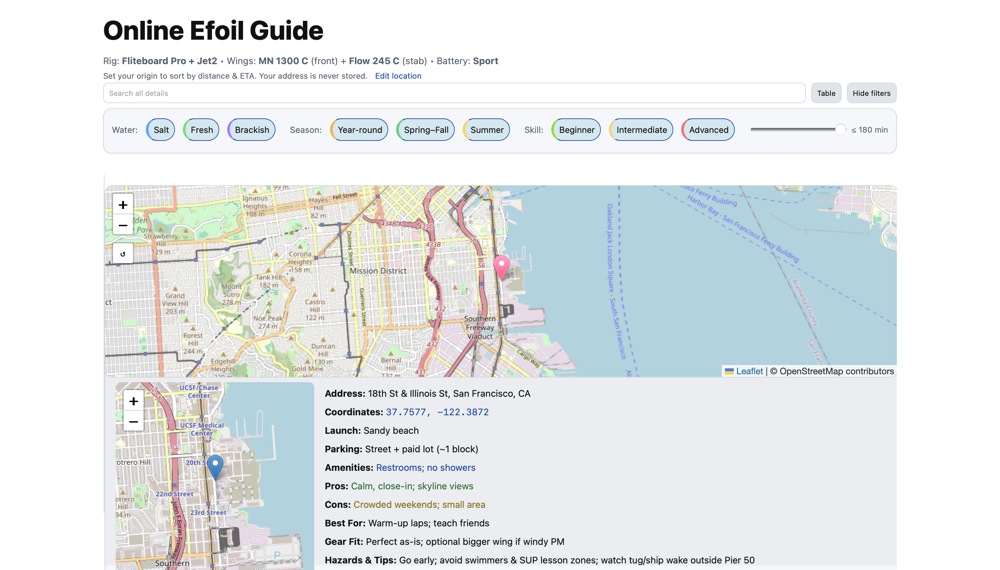
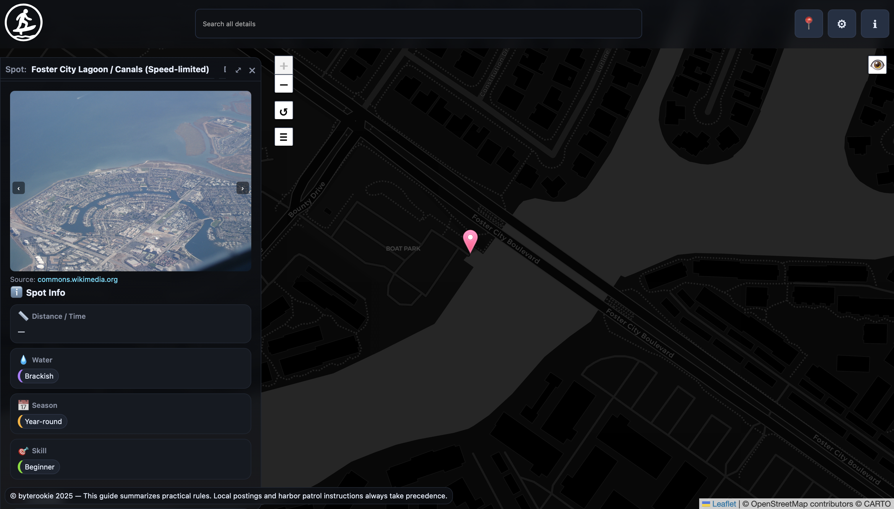

# Online Efoil Guide

A community‑maintained directory of eFoil spots. The site loads all location data from [`data/locations.csv`](data/locations.csv) and renders it in a filterable table and map.
If you’re just looking for spot information, head to https://efoil.guide; the sections below are for contributors.

## Preview




## Add a location
1. Fork this repository.
2. Add a new line to `data/locations.csv` using the existing headers:
   `id,name,city,addr,lat,lng,water,season,skill,launch,parking,amenities,pros,cons,pop,best,gear,tips,law`
   * `skill` uses `|` to separate levels (e.g. `B|I|A`).
   * Wrap text that contains commas in double quotes.
   * Cite rules or facts with `{{Citation: "text" SourceName: "Name" SourceURL: "URL"}}`.

### Field-by-field guide to `data/locations.csv`

| Field   | Description |
|---------|-------------|
| `id`    | Short unique slug used by the site and for linking. |
| `name`  | Human‑readable spot name. Include neighborhood or region if helpful. |
| `city`  | Closest city or town. |
| `addr`  | Street address or description of the launch point. |
| `lat` / `lng` | Decimal WGS84 coordinates. |
| `water` | Water type such as `salt`, `fresh`, or `brackish`. |
| `season`| Typical riding season (e.g. `year`, `spring-fall`). |
| `skill` | Suitable skill levels. Use `B`, `I`, and `A` separated by `|`. |
| `launch`| Description of how to enter the water. |
| `parking`| Parking availability and distance from launch. |
| `amenities`| Facilities on site (restrooms, showers, etc.). |
| `pros`  | Advantages of the spot. |
| `cons`  | Drawbacks or challenges. |
| `pop`   | Typical crowd level. |
| `best`  | Best uses or seasons. |
| `gear`  | Recommended gear choices. |
| `tips`  | Local knowledge, hazards, or suggestions. |
| `law`   | Rules or regulations—use citations. |

### Validate your entry

- Confirm the `id` is unique and uses lowercase with hyphens.
- Verify latitude and longitude against a map service.
- Check for balanced quotes and consistent comma counts.
- Ensure citations in `tips` and `law` follow the format below.
- Preview the site locally by serving the repository via `python -m http.server` and opening `http://localhost:8000` to make sure the row renders (see [Quick Start](#quick-start) for details).

### Citation format

Citations let readers verify information about a spot. They can appear in any field that describes regulations, amenities, or other factual claims.

**Basic citation**

```
{{Citation: "Local rule description" SourceName: "Authority Name" SourceURL: "https://example.org/rules"}}
```

**Multiple sources in one citation**

```
{{Citation: "Hydrofoils permitted year-round" SourceName: "City Parks Dept,State Marine Board" SourceURL: "https://city.gov/foils,https://state.gov/marine"}}
```

**Multiple citations in a field**

Fields can contain more than one citation by placing them sequentially:

```
"Launch from the south ramp {{Citation: \"Ramp map\" SourceName: \"Harbor Authority\" SourceURL: \"https://harbor.example\"}} {{Citation: \"Check tide charts\" SourceName: \"NOAA\" SourceURL: \"https://tides.example\"}}"
```

**Example `locations.csv` row**

```
42,Sample Bay,Sampletown,"123 Harbor Rd",47.60,-122.33,flat,Summer,"B|I","South ramp","Lot A","Restrooms","Calm water","Crowded on weekends",Medium,"June","Wing 5.0","Bring extra batteries {{Citation: \"Battery rules\" SourceName: \"Port Authority\" SourceURL: \"https://port.example/rules\"}}","Wear a leash {{Citation: \"Safety advisory\" SourceName: \"State Parks\" SourceURL: \"https://parks.example/safety\"}}"
```

### Pull request expectations

- Open `index.html` and confirm your spot appears in the table and map without console errors.
- Run any available tests or linters. If none exist, note that manual checks were performed.
- Ensure the CSV remains well‑formed and that your commit contains only the intended change.
- This project has no separate style or contribution guide; follow the patterns in `data/locations.csv`.

3. Commit your changes and open a pull request describing the new spot.

The guide is published via GitHub Pages. After your pull request is merged, the new location will appear on [the live site](https://byterookie.github.io/Efoilguide/).

## Local development
No build step is required. Serve the folder with a static file server—opening `index.html` directly may not load data.

### Quick Start

If you only want to browse the live site, visit [efoil.guide](https://efoil.guide). The steps below run the site locally.

Prerequisite: Node.js not required—this is a static site. You just need Python for a simple server.

1. Clone the repository:

   ```bash
   git clone https://github.com/<your_username>/Efoilguide.git
   cd Efoilguide
   ```
2. Start a simple static server:

   ```bash
   python -m http.server
   ```
3. Open `http://localhost:8000` in your browser.


## License

This project is released under an all rights reserved license; see the [LICENSE](LICENSE) for details.

